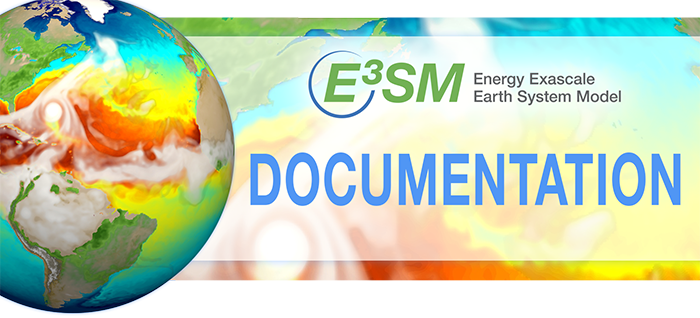

<!-- markdownlint-disable MD033 MD041 -->
<figure markdown>
  
</figure>
# The Energy Exascale Earth System Model Project

Documentation for the tools and models developed by the E3SM Project can
be found at the links below.

## Model, components and related

- [E3SM](https://e3sm-project.github.io/E3SM/) - Model and Components
- [SCMlib](https://github.com/E3SM-Project/scmlib/wiki/E3SM-Intensive-Observation-Period-Case-Library) - Single Column Model Case Library
- [DataDocs](https://e3sm-project.github.io/e3sm_data_docs/_build/html/index.html) - Output from major E3SM simulations
- [HICCUP](https://github.com/E3SM-Project/HICCUP) - Initial conditions from Reanalysis

## Analysis tools

- [E3SM_diags](https://e3sm-project.github.io/e3sm_diags) -  Atmosphere and Land
- [MPAS-Analysis](https://mpas-dev.github.io/MPAS-Analysis/stable/index.html) - Ocean and Sea Ice
- [ChemDiag](https://github.com/E3SM-Project/ChemDyg) - Atmospheric chemistry diagnostics

## Other tools

- [zstash](https://e3sm-project.github.io/zstash) - For HPSS data archiving
- [zppy](https://e3sm-project.github.io/zppy) - For postprocessing workflow
- [e3sm-unified](https://github.com/E3SM-Project/e3sm-unified) - Conda metapackage for all tools
- [COMPASS](https://mpas-dev.github.io/compass/latest/index.html) - Ocean testing and mesh creation
- [EVV4ESM](https://livvkit.github.io/evv4esm) - Tests for non-BFB climate sameness.
- [SCORPIO](https://e3sm-project.github.io/scorpio) - The SCORPIO I/O library.

## User guides

Comprehensive guides for using E3SM and other tools

- [Step-by-step guide to running E3SM](running-e3sm-guide/index.md).
